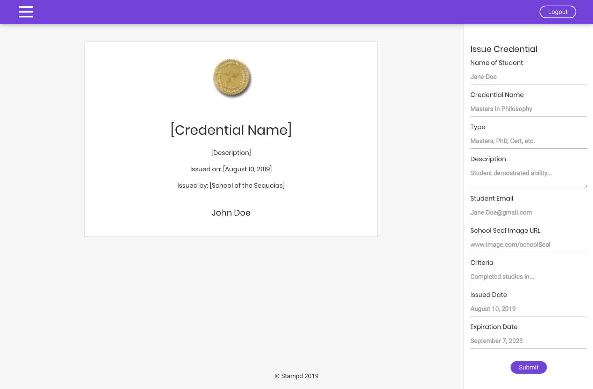

       

#

<h1 align="center"></h1>

# Stampd Client

## Introduction

The education industry has a big problem; in addition to the student debt crisis and other issues, post-student life is often a complete mess. One of these key areas is the credentialing process. Employers and students are often left hanging while employment verifications or the general verification process takes days (or even weeks) to finish. This leaves employers at risk of being understaffed, schools in danger of being short-staffed in their registrars' offices, and students in a position of losing out on great jobs. This is exactly the part where Stampd comes in.

Stampd is a blockchain-based project that allows educational institutions to permanently issue fully verified credentials that are stamped to the Ethereum blockchain. Using blockchain technology, educational institutions can have a fast and cost-effective way to take care of their students; within minutes, a school can issue a credential and email it out, while employers can have peace of mind in knowing that there's no secret way the credential could have been modified or tampered with. This enables fast hires, low budgetary costs, and happy employees.

Easy. Verified. Blockchain. Credentials with Stampd.

## Contributors

|                                            [Aljoe Bacus](https://github.com/joepound)                                             |                                               [Brannan Conrad](https://github.com/BrannanC)                                               |                                      [Byron Holmes](https://github.com/byronholmes2018)                                       |                                            [Megan Jeffcoat](https://github.com/meganjeffcoat)                                            |                                           [CJ Tantay](https://github.com/cjbt)                                            |                                         [Nathan Thomas](https://github.com/nwthomas)                                          |
| :-------------------------------------------------------------------------------------------------------------------------------: | :---------------------------------------------------------------------------------------------------------------------------------------: | :---------------------------------------------------------------------------------------------------------------------------: | :--------------------------------------------------------------------------------------------------------------------------------------: | :-----------------------------------------------------------------------------------------------------------------------: | :---------------------------------------------------------------------------------------------------------------------------: |
|             |                     |  |               |          |         |
|                                              |                                                      |                                   |                                                |                                          |                                          |
|  |  |                                                                                                                               |  |  |  |

## Table of Contents

- [Introduction](#introduction)
- [Contributors](#contributors)
- [Screenshots](#screenshots)
- [Getting Started](#getting-started)
  - [Installation and Setup](#installation-and-setup)
  - [Environment Variables](#environment-variables)
- [Technology Stack](#technology-stack)
  - [React](#react)
  - [React-Conflux](#react-conflux)
  - [Styled-Components](#styled-components)
  - [Grommet](#grommet)
  - [Apollo-Boost](#apollo-boost)
  - [Netlify](#netlify)
  - [Production Dependencies](#production-dependencies)
  - [Development Dependencies](#development-dependencies)
- [APIs Used](#apis-used)
- [Testing](#testing)
- [Project Management](#project-management)
- [Contributing and Getting Involved](#contributing-and-getting-involved)
  - [Issue and Bug Requests](#issue-and-bug-requests)
  - [Feature Requests](#feature-requests)
  - [Pull Request Guidelines](#pull-request-guidelines)
- [Additional Documentation](#additional-documentation)
- [License](#license)
- [Acknowledgements](#acknowledgements)

## Screenshots

## Getting Started

This repository contains a **yarn.lock** file. Please do not remove this file from your local code, as the integrity of the application cannot be gauranteed if versions that may be incompatible with each other are used by installing the newest version of each dependency.

#### Installation and Setup

To get the client running locally, clone this repo and use the following commands/steps:

1. **cd** into the `root` directory and then into the `client` directory
2. Use the **yarn** command in the `client` directory to install all required dependencies
3. Use the **yarn install** command to start the local instance of `React` in your default browser
4. Use the **yarn test** command to start the `React` testing environment
5. Use the **yarn lint** command to start the `Eslint` linting environment

#### Environment Variables

In order for the app to function correctly, the user must set up their own environment variables. There should be a `.env` file containing the following:

    *  REACT_APP_AUTH0_DOMAIN - This is an Auth0 domain, generated in the Auth0 dashboard
    *  REACT_APP_AUTH0_CLIENT_ID - This is an Auth0 clientId, generated in the Auth0 dashboard
    *  REACT_APP_SENTRY - Sentry URL that connects front end for continuous intergration
    *  REACT_APP_GRAPHQL_URI - Backend GraphQL API of Stampd
    *  REACT_APP_AUTH0_AUDIENCE - Audience to access token from Auth0
    *  REACT_APP_AUTH_TOKEN - JWT token that is sent to the backend that consist of user given by Auth0

## Technology Stack

The following is a short list of the major dependencies and methods used (with the reasons we used them) followed by complete and exhaustive ones with all production and development packages incorporated in the client build.

#### React

- Virtual DOM provides superior performance over alternatives like `jQuery`
- `ReactJS` is a such a popular libary that many modules are available. Also, it's easy to find relevant and timely information when debugging errors

#### React-Conflux

- `Redux`-like pattern for state management
- Allows for context-dependent `redux`-like state stores
- One way binding (one source of truth)
- Built around `React Hooks` and the `Context API`

#### Styled-Components

- `CSS` in `JS`
- Powerful way to style components using props
- Allows for rapid styling and reusability

#### Grommet

- Simple, clean looking components come styled out-of-the-box
- Pleasant built-in color palletes
- Built with `styled-components`
- Good ease-of-use to other component libraries

#### Apollo-boost

- Stand-alone and defacto way to query a `GraphQL` server without the need of the state management you get from `react-apollo`

#### Netlify

- Preferred method of deployement due to automatic `SSL` certificates and easy continuous integration setup
- Close coupling with GitHub makes for a superior development experience

#### Production Dependencies

- [@auth0/auth0-spa-js](https://github.com/auth0/auth0-spa-js)
- [@sentry/browser](https://www.npmjs.com/package/@sentry/browser)
- [apollo-boost](https://github.com/apollographql/apollo-client/tree/master/packages/apollo-boost)
- [graphql](https://www.npmjs.com/package/graphql)
- [grommet](https://www.npmjs.com/package/grommet)
- [grommet-icons](https://github.com/grommet/grommet-icons)
- [jsonwebtoken](https://github.com/auth0/node-jsonwebtoken)
- [prop-types](https://www.npmjs.com/package/prop-types)
- [react](https://www.npmjs.com/package/react)
- [react-conflux](https://github.com/dustinmyers/react-conflux)
- [react-dom](https://www.npmjs.com/package/react-dom)
- [react-loader-spinner](https://www.npmjs.com/package/react-loader-spinner)
- [react-router-dom](https://www.npmjs.com/package/react-router-dom)
- [react-scripts](https://www.npmjs.com/package/react-scripts)
- [styled-components](https://github.com/styled-components/styled-components)

#### Development Dependencies

- [eslint](https://eslint.org/)
- [eslint-config-airbnb](https://www.npmjs.com/package/eslint-config-airbnb)
- [eslint-config-prettier](https://github.com/prettier/eslint-config-prettier)
- [eslint-plugin-import](https://www.npmjs.com/package/eslint-plugin-import)
- [eslint-plugin-jsx-a11y](https://www.npmjs.com/package/eslint-plugin-jsx-a11y)
- [eslint-plugin-prettier](https://github.com/prettier/eslint-plugin-prettier)
- [eslint-plugin-react](https://www.npmjs.com/package/eslint-plugin-react)
- [prettier](https://github.com/prettier/prettier)

## APIs Used

#### Auth0

Auth0 provides authentication as a service. It provides developers with the ability to secure their applications using industry standards, like OAuth 2.0 and JSON Web Tokens (JWTs), without needing to become security experts themselves. Auth0 is a full-featured service, offering many options such as Single Sign-on (SSO), Multi-factor Authentication (MFA) and IP blacklisting.

#### Infura

Infura gives 3 big benefits to developers of Ethereum-based apps: speed, scalability and data storage. It provides speed by allow quick access to the Ethereum blockchain, without having to set up an Ethereum node or wallet. Infura provides scalability by managing nodes for the developer. Finally, it allows for off-chain data storage, which is huge, since on-chain data storage is complicated and expensive.

#### Stripe

Stripe is a service that allows users to make and accept online payments. Through its API, Stripe frees developers from the technological, security and regulatory burdens that come with handling sensitive user payment information, such as credit card numbers. Stripe also allows for the processing of many kinds of transactions, including one-time payments and subscriptions, and these transactions maybe processed using a variety of payment methods.

## Testing

Testing is performed using the following dependencies:

- [@testing-library/react](https://github.com/testing-library/react-testing-library)
- [jest-dom](https://github.com/testing-library/jest-dom)
- [react-test-renderer](https://reactjs.org/docs/test-renderer.html)

In addition, we have incorporated custom test helpers called `renderWithRouter` and `rendererWithRouter` in order to accomodate testing while using [React Router](https://www.npmjs.com/package/react-router).

## Project Management

The following documents and links contain all the project management documents for Stampd. Included are a Trello board, the project vision document (which contains links to the UX wireframes and layouts), and the Google Drive with our user interviews:

- [Trello Board](https://trello.com/b/uvhiXJ58/stampd)
- [Project Vision Document](https://www.notion.so/Stampd-495609cb1e06435daf900fdaf5ee55f1)
- [User Interviews](https://drive.google.com/drive/folders/17dBTV1TwsZ6fkYOwTTcnmQUYVyi7ptS0?usp=sharing)

## Contributing and Getting Involved

If you spot a bug or would like to request a feature, we welcome and are grateful for any contributions from the community. Please review the process for contributing to this project by reading the [contribution guidelines](CONTRIBUTING.md).

Also, please note we have a [code of conduct](./CODE_OF_CONDUCT.md). Please follow it in all your interactions with the project.

#### Issue and Bug Requests

If you are having an issue with the existing project code, please submit a bug report under the following guidelines:

- Check first to see if your issue has already been reported.
- Check to see if the issue has recently been fixed by attempting to reproduce the issue using the latest master branch in the repository.
- Create a live example of the problem.
- Submit a detailed bug report including your environment & browser, steps to reproduce the issue, actual and expected outcomes, where you believe the issue is originating from, and any potential solutions you have considered.

#### Feature Requests

We would love to hear from you about new features which would improve this app and further the aims of our project. Please provide as much detail and information as possible to show us why you think your new feature should be implemented.

#### Pull Request Guidelines

- Ensure any install or build dependencies are removed before the end of the layer when doing a build.
- Update the README.md with details of changes to the interface, including new plist variables, exposed ports, useful file locations and container parameters.
- Ensure that your code conforms to our existing code conventions and test coverage.
- Include the relevant issue number, if applicable.
- You may merge the Pull Request in once you have the sign-off of two other developers, or if you do not have permission to do that, you may request the second reviewer to merge it for you.

## Additional Documentation

See [Backend Documentation](https://github.com/labs14-stampd/backend) for details on the backend of our project.

## License

[MIT](LICENSE)

## Acknowledgements

- [Lambda School](https://lambdaschool.com/) - Thank you for educating us, equipping us with our current skillset, and pushing us towards success.
- [Josh Knell](https://github.com/BigKnell) - The Big Boss. The Big Cheese. Thanks for teaching us the basics and for keeping it real. Banjo on.
- [Dustin Myers](https://github.com/dustinmyers) - The Legend himself. Dustin is the reason we can even write a single line of code in React. Thanks for your leadership, Dustin.
- [Luis Hernandez](https://github.com/luishrd) - Luis, thanks for teaching us about the Bros and Homies. Your leadership in Lambda School back-end week lets us build servers and move mountains.
- [John Mitchell](https://github.com/jrmmba8314) - You opened up the statically-typed world of Java to us. Thank you for being a steady hand at the wheel when we needed it.
- [Dan Levy](https://danlevy.net/) - Thanks for all of your advice, Dan. You consistently come through with gold when we need it. Your advice is invaluable, and you care about students.
- [Coffee](https://en.wikipedia.org/wiki/Coffee) - We'd like to thank coffee for the productivity of this Labs project. Seriously. Thanks.
